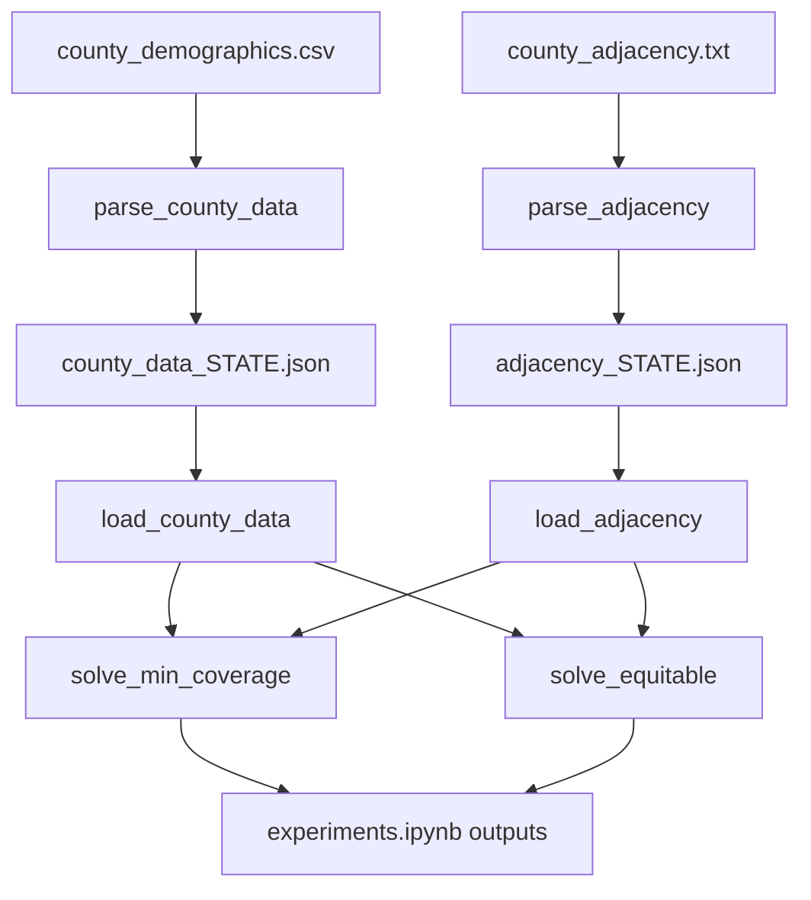

# Dataset and Pipeline Summary

## Project Scope

This project evaluates county-level vaccine center placement with two optimization methods:

- `solve_min_coverage`: minimize the number of centers while covering every county via graph adjacency.
- `solve_equitable`: choose up to `k` centers to minimize population-weighted travel distance.

The fundamental unit across the pipeline is a **county**, identified by 5-digit county `FIPS`.

## End-to-End Data Pipeline

### Pipeline Stages

1. Select state (`STATE_NAME` -> `STATE_FIPS`) and budget `K` in `experiments.ipynb`.
2. Parse raw adjacency and demographics files for that `STATE_FIPS`.
3. Write state-specific JSON artifacts into `county_data/augmented_data/`.
4. Load artifacts into memory (`adj`, `cdata`).
5. Run both optimization models and collect center selections and objective values.
6. Build map/DataFrame outputs for interpretation.

## Function-by-Function Reference

### `py_scripts/parse_county_data.py`

- `parse_county_data(filepath, state_fips)`
  - **Purpose:** filter county demographics to a single state and normalize fields.
  - **Inputs:**
    - `filepath`: demographics CSV path.
    - `state_fips`: state code (normalized to two digits).
  - **Required source columns (flexible names supported):**
    - FIPS: `fips` or `geoid` or `countyfips`
    - Name: `name` or `ctyname` or `county_name`
    - State: `state` or `stname` or `state_name`
    - Population: `population` or `popestimate2025` or `pop`
    - Latitude: `lat` or `intptlat` or `latitude`
    - Longitude: `lon` or `intptlong` or `longitude`
  - **Output (in-memory):** dictionary keyed by county FIPS.
  - **Side effect (file):** writes `county_data/augmented_data/county_data_<state_fips>.json`.
- `load_county_data(state_fips)`
  - **Purpose:** load the generated county JSON for a state.
  - **Input:** `state_fips`.
  - **Output:** parsed dictionary from `county_data_<state_fips>.json`.
- internal helper `col(*names)` (nested inside `parse_county_data`)
  - **Purpose:** resolve flexible column aliases to real headers in the input CSV.
  - **Output:** matched header name or `None`.

### `py_scripts/parse_adjacency.py`

- `_iter_adjacency_rows(filepath)`
  - **Purpose:** parse the Census adjacency text format robustly, including continuation rows where the left county is blank.
  - **Input:** path to the pipe-delimited adjacency file.
  - **Output:** stream of `(county_fips, neighbor_fips)` tuples.
- `parse_adjacency(filepath, state_fips)`
  - **Purpose:** build an in-state undirected county adjacency graph.
  - **Inputs:**
    - `filepath`: adjacency text file path.
    - `state_fips`: state code (first two digits of county FIPS).
  - **Processing details:**
    - Keeps only edges where both endpoints are in the selected state.
    - Drops self-edges.
    - Enforces symmetry (`u` contains `v` and `v` contains `u`).
    - Sorts neighbor lists for stable output.
  - **Output (in-memory):** `dict[county_fips] = list[neighbor_fips]`.
  - **Side effect (file):** writes `county_data/augmented_data/adjacency_<state_fips>.json`.
- `load_adjacency(state_fips)`
  - **Purpose:** load generated adjacency JSON.
  - **Input:** `state_fips`.
  - **Output:** parsed adjacency dictionary.

### `py_scripts/min_coverage.py`

- `solve_min_coverage(adj, county_data)`
  - **Purpose:** solve a minimum dominating set model.
  - **Inputs:**
    - `adj`: adjacency dictionary from `parse_adjacency`.
    - `county_data`: county dictionary from `parse_county_data`.
  - **Model:**
    - Binary decision `x[c] = 1` if county `c` hosts a center.
    - Objective: minimize `sum(x[c])`.
    - Coverage constraint for each county `i`: `x[i] + sum(x[j] for j in neighbors(i)) >= 1`.
  - **Output:** `(centers, objective, elapsed_seconds)`.
  - **Solver:** Gurobi (`GRB.OPTIMAL` required).

### `py_scripts/equitable_placement.py`

- `_haversine_miles(lat1, lon1, lat2, lon2)`
  - **Purpose:** compute great-circle distance in miles.
  - **Output:** numeric distance used in assignment costs.
- `solve_equitable(adj, county_data, k)`
  - **Purpose:** solve a p-median-style facility placement model.
  - **Inputs:**
    - `adj`: accepted for API consistency, not used in objective/constraints.
    - `county_data`: county metadata with population and coordinates.
    - `k`: max number of centers.
  - **Model:**
    - Binary `y[j]` indicates county `j` selected as a center.
    - Binary `z[i,j]` indicates county `i` assigned to center `j`.
    - Objective: minimize population-weighted travel cost `sum(pop[i] * dist[i,j] * z[i,j])`.
    - Constraints:
      - `1 <= sum(y[j]) <= k`
      - each county assigned exactly once
      - assignment only to opened centers (`z[i,j] <= y[j]`)
  - **Output:** `(centers, objective, elapsed_seconds, assigned_dict)`.
  - **Solver:** Gurobi (`GRB.OPTIMAL` required).

## Dataset-by-Dataset Reference

### Raw Input Datasets

- `county_data/county_demographics.csv`
  - **Header:** `FIPS,name,state,population,lat,lon,area_sqmi`
  - **Represents:** one row per county with demographics and centroid location.
  - **Pipeline usage:** primary input to `parse_county_data`.
  - **Consumed fields:** `FIPS`, `name`, `state`, `population`, `lat`, `lon`
- `county_data/county_adjacency.txt`
  - **Header:** `County Name|County GEOID|Neighbor Name|Neighbor GEOID|Length`
  - **Represents:** county border adjacency pairs (including cross-state neighbors in raw file).
  - **Pipeline usage:** primary input to `parse_adjacency`.
  - **Consumed fields:** county FIPS and neighbor FIPS columns.
- `county_data/cb_2023_us_county_500k/` (shapefile bundle)
  - **Represents:** county boundary geometries for plotting.
  - **Typical fields:** `STATEFP`, `COUNTYFP`, `GEOID`, `NAME`, `ALAND`, `AWATER`, `geometry`.
  - **Pipeline usage:** consumed in `experiments.ipynb` for map visualizations.

### Generated / Instance Datasets

Generated in `county_data/augmented_data/` by preprocessing scripts:

- `county_data_<state_fips>.json`
  - **Key:** county FIPS.
  - **Value fields:** `name`, `state`, `population`, `lat`, `lon`
  - **Used by:** both optimization methods.
- `adjacency_<state_fips>.json`
  - **Key:** county FIPS.
  - **Value:** sorted list of adjacent county FIPS in the same state.
  - **Used by:** `solve_min_coverage` (directly), passed to `solve_equitable` (currently unused).

## Tested Instances

Available prepared instances in `county_data/augmented_data/` are:

| State FIPS | State Name    | `county_data` counties | `adjacency` nodes | Undirected adjacency edges |
| ---------- | ------------- | ---------------------- | ----------------- | -------------------------- |
| 12         | Florida       | 67                     | 67                | 160                        |
| 15         | Hawaii        | 5                      | 2                 | 1                          |
| 18         | Indiana       | 92                     | 92                | 240                        |
| 26         | Michigan      | 83                     | 83                | 225                        |
| 29         | Missouri      | 115                    | 115               | 294                        |
| 42         | Pennsylvania  | 67                     | 67                | 171                        |
| 54         | West Virginia | 55                     | 55                | 127                        |

### Instance Notes

- The notebook is currently configured to run `STATE_NAME = "West Virginia"` (`STATE_FIPS = "54"`).
- Current budget for equitable model: `K = 20`.
- Hawaii (`15`) has fewer adjacency nodes than counties in the generated graph (2 vs 5), reflecting disconnected/non-contiguous county relationships in the source adjacency data.

## Experiment Output Interpretation (`experiments.ipynb`)

Notebook flow:

1. Import parser and solver functions.
2. Set `STATE_NAME`, derive `STATE_FIPS`, and set `K`.
3. Build/load state-specific JSON artifacts.
4. Run `solve_min_coverage(adj, cdata)` and print:
  - number of centers,
  - objective (minimum center count),
  - runtime.
5. Run `solve_equitable(adj, cdata, K)` and print:
  - number of centers used (bounded by `K`),
  - objective (population-weighted distance),
  - runtime.
6. Build two tabular outputs:
  - `df_a`: `FIPS`, `County`, `Population`, `Is_Center`.
  - `df_b`: `FIPS`, `County`, `Population`, `Is_Center`, `Assigned_To`.
7. Plot two maps with selected centers over county geometries.

Recorded notebook outputs for the current West Virginia run:

- Min coverage: `11 centers, objective 11.0, 0.0107s`
- Equitable (`k=20`): `20 centers, objective 11188842.14, 0.0251s`

## Output Artifacts and What They Mean

- `centers_a` (from min coverage): smallest center set that graph-covers all counties.
- `centers_b` (from equitable): centers minimizing weighted distance under budget.
- `assigned` (equitable): county-to-center assignment mapping used for `Assigned_To`.
- `obj_a`: integer-like domination objective (count of opened centers).
- `obj_b`: weighted travel cost objective (population * miles).
- map figures: geographic context for center placement patterns.

## Known Limitations / Implementation Notes

- `solve_equitable` currently ignores adjacency structure; it is purely distance/population based.
- Both optimization methods require `gurobipy` and a valid Gurobi setup.
- The main execution path is notebook-driven (`experiments.ipynb`), not a dedicated CLI pipeline script.

